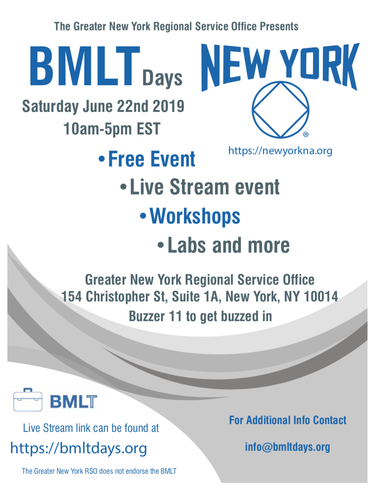

join info: https://zoom.us/j/613507415

| Time  | Topic   | Description  |
|---|---|---|
| 10a-10:45a  | Root Server part 1  | The BMLT Root Server is the piece that makes all BMLT Enabled projects possible. This will be an introduction to the BMLT Root Server, and hands-on training for Root Server installation and administration. |
| 10:45a-11:00a  | *break* |   | 
| 11:00a-12:00p  | Root Server Part 2  | Continuation of Part 1, with time for interactive Q&A.  | 
| 12:00p-12:15p | *break* |   | 
| 12:15p-12:30p  |  *lunch*\ BMLT Townhall  | A Brief History of the BMLT |
| 12:30p-1:30p  | *lunch*\ BMLT Townhall  | BMLT 3.0 - a look at what has been designed for BMLT 3.0, Roadmap and How you can help |
| 1:30p-1:45p  | *lunch*\ BMLT Townhall  | Where we want to take the BMLT and the positions that we are currently in need of.  | 
| 1:45p-2p  | *break* |   | 
| 2p-3p  | Yap  | Yap is open-source software that connects into a BMLT root server that enables meeting list lookups over the phone and volunteer call routing.   This workshop will cover a brief overview of Yap.  A deeper dive will be given into new features such as Groups, Volunteer Training, and Language based routing.    | 
| 3p-3:15p  | *break* |   | 
| 3:15p-5p  | BMLT It Works How and Why  | Currently there are close to forty root servers running around the world with over 23,000 meetings in them. This workshop will cover how the BMLT works for various different service bodies. |
| 5p - 8p | *dinner break* 
| 8:00p | Recovery Meeting | We will have an NA recovery meeting that will be live streamed from the Greater New York RSO  | 

